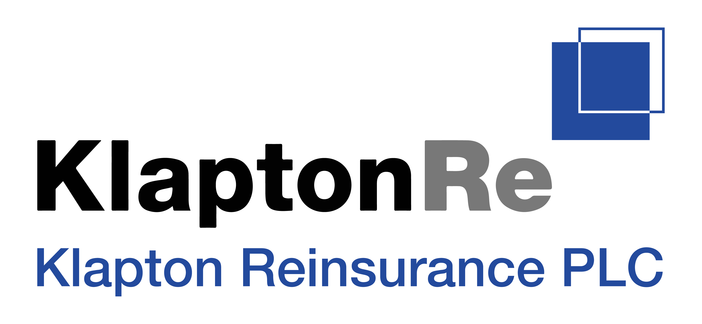

<!--
KRE brand: primary #234A9E, white #FFFFFF, neutral grey.
This plan is the product and engineering baseline. Model assumptions remain subject to the formal scientific gates defined below.
-->

# CASS Earthquake Catastrophe Modelling Platform Build Plan

*End to End Delivery Roadmap*

| Prepared for | Klapton Reinsurance PLC |
| --- | --- |
| Planning date | 12 September 2026 |
| Document version | 1.7 CASS Naming and ODS Reference Baseline |
| Initial peril | Earthquake |
| Pilot countries | Indonesia and Nepal |
| Deployment | KRE servers or approved local Docker installations |
| Hazard spatial basis | Fixed adaptive area-peril grids |

**Purpose**

This plan defines the product, scientific, data, engineering, validation and operating work required to build CASS, Klapton Reinsurance PLC's integrated catastrophe modelling application. It establishes the target architecture and a staged route from the proven Docker test environment to a governed earthquake modelling service.

## 1  Executive Direction

CASS will be one browser-based catastrophe modelling product while preserving OpenQuake and Oasis as independently owned calculation engines. React will provide the analyst experience. Django will provide authentication, workflow orchestration, metadata, lineage and a stable CASS API. OpenQuake will generate earthquake hazard. A CASS converter owned by KRE will transform supported OpenQuake outputs into versioned Oasis hazard packages. Oasis will apply vulnerability and financial structures and produce insured loss outputs.

### Product and company naming

**CASS is the application name. Klapton Reinsurance PLC, abbreviated KRE, is the company, data owner, model owner and deployment organisation.** Product-facing language, code namespaces, APIs, services, containers, support bundles and interface headings will use CASS. KRE will appear only where the company identity or economic meaning matters, including legal ownership, branding, permissions, source data, KRE servers, KRE-share TIV and KRE portfolio results.

The primary interface title is `CASS`, with `Klapton Reinsurance PLC` as the organisation subtitle or footer. Technical names should use forms such as `cass_api`, `cass_core`, `cass_oed`, `cass_keys`, `cass_converter` and `CASS_*` environment variables. New implementation must not introduce `kre_*` product namespaces. Historical names may remain temporarily only behind migration aliases with an explicit removal date.

The platform will use Docker as the common execution boundary from development onward. Large scientific arrays will remain in HDF5, Parquet or Oasis binary artifacts stored outside the Django relational database. PostgreSQL will hold application records, references, checksums and audit history. This design avoids Windows path problems, prevents the user interface database from becoming a scientific array store, and allows each engine to be upgraded behind a tested adapter.

Exposure enrichment will follow an evidence hierarchy: reported KRE or cedant data, reliably derived data, permitted external corroboration, GEM-informed probabilistic assumptions, then documented expert overrides. Assumptions will never overwrite reported facts. Every inferred field will retain its source, confidence and assumption-set version, and analysts will be able to compare approved alternative assumptions. GEM exposure is therefore a prior for missing attributes rather than a statement of fact about an individual insured building.

The first technical model gate is an SA-only prototype using SA(0.3), SA(0.6) and SA(1.0), beginning with an SA(0.3) vertical slice. This deliberately narrows the converter proof while retaining the period-specific nature of spectral acceleration. The complete 2026 GEM functions also contain PGA-based classes, so the SA-only package is a research prototype and may not be published as a complete Indonesia or Nepal portfolio model until exposure coverage is measured and the PGA classes are either added or replaced through an approved scientific method.

**Build Outcome**

- The internal CASS application through which an analyst can select a model, upload and validate exposure, run earthquake hazard and loss analyses, monitor progress, inspect quality checks, compare results and export governed outputs.

- A reproducible earthquake model build process using stable geographic area-peril definitions, explicit event semantics, versioned vulnerability functions and documented financial assumptions.

- A governed exposure-enrichment process that preserves reported data, quantifies missingness, represents uncertain characteristics as distributions or scenarios and exposes their effect on loss results.

- A portable container deployment that works on the current Windows workstation through Docker Desktop and can move to a managed Linux container environment without changing the product architecture.

- An extensible foundation on which additional countries and perils can be added through engine and model adapters rather than rewrites of the user interface.

**Current Evidence**

The official PiWind model has already completed end to end in the Oasis 2.5.7 model worker container against a Windows bind-mounted workspace. The test produced ground-up, insured and reinsurance outputs and passed the model validation check. This proves the selected local container boundary. It does not yet prove earthquake model correctness, production capacity or platform security; those are explicit workstreams in this plan.

A KRE portfolio snapshot dated 30 June 2026 is now available for controlled testing in CASS. It contains 1,353 policy rows and 224 geocoded risk-location rows linked to 213 businesses across Indonesia and Nepal. All location rows have valid coordinate pairs, but 115 require review. `gross_limit` is confirmed as TIV at KRE's share, all monetary values are USD and every policy is assumed to cover earthquake. Total policy TIV is USD 3.328 billion, of which USD 822.817 million belongs to businesses with coordinates. The extract remains incomplete for vulnerability selection because it lacks coverage-component values and building attributes. It is scoped first as an import, hierarchy, geospatial and workflow asset, then as a KRE-share research loss portfolio under explicit allocation and enrichment assumptions. Detailed implementation instructions are in [CASS Geocoded Portfolio Test Dataset Integration Instructions](CASS%20Geocoded%20Portfolio%20Test%20Dataset%20Integration%20Instructions.md).

**Recommended Release Boundary**

Release one is the internal CASS earthquake portfolio analysis platform. It will run centrally on KRE servers or be provided as a controlled Docker package to approved key users for local execution. External client tenancy, public self-service onboarding, billing, real-time event response and non-earthquake perils are deferred until the internal workflow and model governance are proven.

**Primary Interface Principle**

The CASS web application is the primary operating interface for release one, not a reporting layer added after the engine work. From the first usable vertical slice, analysts will use CASS screens to prepare exposure, select approved settings, submit OpenQuake and Oasis work, monitor the combined pipeline, resolve permitted exceptions and inspect results. Native OpenQuake and Oasis interfaces and command-line tools remain restricted specialist routes for model development, diagnosis, validation and recovery; routine portfolio users should not need them.

## 2  Product Scope

### Primary users

| User | Primary need | Release one capability |
| --- | --- | --- |
| Catastrophe modeller | Build and validate model versions | Configure hazard, run conversion, register vulnerability, review scientific QA and publish model versions |
| Portfolio analyst | Run governed portfolio analyses | Upload OED exposure, resolve validation issues, set analysis options, monitor jobs and review loss metrics |
| Underwriter or pricing user | Interpret decision metrics | Review approved AAL, EP curves, event losses, geographic concentrations and comparison views |
| Platform administrator | Operate a reliable controlled service | Manage users, roles, storage, engines, queues, retention and audit records |
| Reviewer or approver | Provide independent challenge | Review assumptions, validation evidence, exceptions and model publication gates |

### Release one functional scope

- Authentication, role-based access and project workspaces.

- Model registry covering country, peril, engine version, hazard source, grid, vulnerability set, financial capability and publication state.

- Guided creation, import, editing and export of OED location, account and reinsurance data, with validation, enrichment, error reports, financial-term interpretation and controlled normalization.

- Automatic generation and validation of model lookup outputs, Oasis ground-up-loss inputs, insured-loss financial structures, reinsurance structures and run settings; routine users will not author kernel CSV or binary files.

- OpenQuake job creation, configuration validation, execution, progress, logs and artifact capture.

- OpenQuake to Oasis conversion with chunked HDF5 processing, deterministic identifiers, scientific QA and reproducible packaging.

- Oasis keys lookup, file generation and ground-up, insured and reinsurance loss calculation through the Oasis API.

- Results catalogue with average annual loss, exceedance probability curves, event loss tables, geographic summaries, run comparisons and downloadable OED or ORD-aligned outputs.

- Audit history, approvals, retention controls and operational dashboards.

### Deferred scope

- External multi-tenant client access and client-specific branding.

- Cyclone, flood and other perils, except for the extension points required to add them later.

- Feature-for-feature replication of every native OpenQuake and Oasis administration, development and diagnostic function. Release one will still replace the native interfaces for the complete routine CASS analyst workflow; specialist engine interfaces remain available behind controlled access for capabilities that add no business value to rebuild.

- Real-time post-event loss estimation and live sensor or agency feeds.

- Pricing workflow integration, policy administration integration and automated capital model submissions.

- Highly available multi-region deployment before workload and recovery requirements justify it.

## 3  Product Experience

### Principal user journey

1. Create or open a project and select an approved earthquake model version.

1. Import an existing portfolio or create exposure and financial records through guided CASS forms, templates and bulk-edit workflows.

1. Review the generated OED location, account and reinsurance views together with validation, geocoding and model-coverage findings; correct or explicitly approve permitted exceptions.

1. Choose analysis options from model-defined settings rather than editing engine configuration files.

1. Submit the analysis and follow a single CASS status view while Django coordinates the OpenQuake, conversion and Oasis tasks.

1. Review scientific and operational checks before results are released to decision users.

1. Explore loss results, maps, curves and comparisons, then export an auditable result package.

### Core screens

| Screen | Purpose | Key content |
| --- | --- | --- |
| Portfolio dashboard | Show current work and exceptions | Recent projects, run status, failed checks, storage and model notices |
| Model catalogue | Select an approved model | Country, peril, version, publication state, assumptions and validation date |
| Exposure workspace | Create and prepare model inputs | Guided records, template import, OED preview/export, geocoding, field completeness, reported versus inferred attributes, confidence, assumption scenarios, TIV summaries and unmapped records |
| Financial structure workspace | Create insurance and reinsurance inputs | Accounts, policies, location terms, layers, signed shares, RI contracts, scope filters, inuring priorities, reconciliation and unsupported-term warnings |
| Analysis builder | Configure a governed run | Model settings, financial options, outputs, resource profile and validation summary |
| Run monitor | Explain progress and failure | Pipeline stage, elapsed time, logs, warnings, artifacts and retry controls |
| Results workspace | Support risk interpretation | AAL, EP curves, event tables, maps, assumption ranges, uncertainty attribution, comparisons and downloads |
| Model build workspace | Manage scientific assets | Hazard runs, converter QA, vulnerability sets, model packages and approval gates |
| Administration | Operate the service | Users, roles, engine health, queues, storage, retention and audit search |

### Visual design system

The interface should use KRE blue #234A9E as the primary action, navigation and selection colour; white as the principal workspace surface; and a restrained neutral grey scale for borders, secondary text, inactive states and dense analytical views. Black remains the default reading colour. Charts should reserve KRE blue for the principal series and use accessible, colour-blind-safe secondary colours only where comparison requires them.

- Use a left navigation rail for stable product areas and a wide content canvas for maps, curves and tables.

- Make model version, portfolio, financial perspective and run state continuously visible.

- Make assumed values visually distinguishable from reported values and allow users to inspect the rule, evidence and confidence behind every material inference.

- Translate engine terminology into analyst language while retaining expandable technical details for modellers.

- Use progressive disclosure for advanced OpenQuake and Oasis settings.

- Meet WCAG 2.1 AA contrast and keyboard-navigation expectations, including non-colour status cues.

- Treat long-running work as background jobs; never require the browser to remain open.

## 4  Target Architecture

The architecture separates the control plane from the scientific data plane. Django coordinates work and records what happened. Engine services perform calculations. Artifact storage carries large immutable inputs and outputs. Every boundary is accessed through a versioned adapter or supported API.

### End to end service flow

| CASS React | CASS Django | OpenQuake | CASS Converter | Oasis |
| --- | --- | --- | --- | --- |
| Analyst workflow and results | Identity, orchestration, metadata and audit | Earthquake hazard and supported exports | HDF5 to events, occurrence and footprint | Vulnerability, financial terms and loss outputs |

Shared infrastructure: PostgreSQL for CASS application records; an object store for uploads, HDF5, model packages and results; a background task queue; centralized logs and metrics; and a secrets service. The OpenQuake and Oasis internal stores remain engine-owned.

### Component responsibilities

| Component | Responsibility | Boundary rule |
| --- | --- | --- |
| React TypeScript application | Analyst workflow, validation presentation, mapping, charting and result comparison | Calls only the CASS API; does not call engine APIs directly |
| Django REST API | Users, roles, projects, runs, model registry, metadata, approvals and audit | Stores references to large artifacts, not scientific arrays |
| Portfolio and OED service | Editable exposure and contract records, imports, enrichment, schema validation and immutable OED publication | Business data is authoritative until an OED version is published; generated Oasis kernel files are never edited here |
| Workflow workers | Execute durable jobs, retries, cancellation and stage transitions | Every task is idempotent and records input and output checksums |
| OpenQuake adapter | Submit, monitor and export calculations through supported interfaces | No CASS writes to OpenQuake internal tables |
| Converter service | Translate versioned OpenQuake output into validated Oasis model data | Pinned compatibility matrix and deterministic output |
| CASS keys service | Map OED locations and coverages to area-peril and vulnerability identifiers | Complete success/failure response and TIV reconciliation for every expected mapping |
| Oasis adapter | Register models, upload exposure, run analyses and collect outputs | Use the Platform API rather than modifying the Oasis UI |
| Artifact store | Hold large immutable and versioned files | Content checksum, retention class and access policy on every object |
| PostgreSQL | Hold CASS control-plane records | No event-site-IMT observation table |
| Observability stack | Aggregate structured logs, metrics, traces and alerts | Correlation ID follows every run across all services |

### Recommended technology baseline

- React with TypeScript and a documented CASS component library; MapLibre GL JS for maps; a mature charting library for EP and loss distributions.

- Django, Django REST Framework and generated OpenAPI contracts; PostgreSQL for the CASS database.

- Celery-compatible durable background execution. Redis is acceptable for development; RabbitMQ or another production-grade broker should be selected through the deployment decision.

- S3-compatible object storage. A local filesystem-backed service is acceptable for the first workstation deployment if the same object interface is preserved.

- Docker Compose for local development and the first controlled deployment; managed containers or Kubernetes only when availability and workload justify the operating overhead.

- Pinned container image digests, software bills of materials, vulnerability scanning and a tested engine compatibility matrix.

### Distribution and deployment model

The same versioned container set should support two approved operating modes. A CASS installation on KRE servers provides centralized identity, shared models, managed storage, coordinated updates and multi-user access. An approved local CASS installation provides the React application, Django API, PostgreSQL, object storage, task queue, OpenQuake, the converter and Oasis through Docker Compose on the user's device.

- The local package must not contain KRE production credentials, unrelated portfolios or unrestricted administrative secrets.

- Model packages and container images must be signed or checksummed so the application can show whether an installation is approved and unmodified.

- Local users need an exportable support bundle containing versions, health status and sanitized logs, without portfolio contents by default.

- Updates should be distributed as tested release bundles with database migrations, model compatibility information and rollback instructions.

- CASS server and local installations should produce the same scientific results when given the same inputs, model versions, settings and compute profile.

## 5  Application and Data Model

### CASS control-plane records

| Record | Purpose | Examples of retained fields |
| --- | --- | --- |
| Project | Business workspace | Owner, team, purpose, access, status |
| Exposure version | Immutable input version | OED version, file references, schema result, TIV summaries, checksum |
| Assumption set | Approved enrichment policy | Country, segment, rules, probability distributions, scenario label, provenance, approval and version |
| Enrichment run | Traceable application of assumptions | Exposure version, assumption set, observed/derived/imputed counts, confidence, exceptions and output checksum |
| Model version | Published calculation capability | Country, peril, engine versions, grid, hazard, vulnerability and approval state |
| Hazard run | OpenQuake execution record | Calculation ID, settings hash, image digest, state, timings and artifact references |
| Conversion run | OpenQuake to Oasis lineage | Converter version, event policy, binning, source and target checksums, QA state |
| Analysis run | Portfolio loss execution | Exposure, model, settings, financial perspective, queue state and Oasis identifiers |
| Result set | Discoverable approved outputs | ORD artifacts, AAL, validation state, publication and retention |
| Audit event | Governance evidence | Actor, action, timestamp, object, before and after references |

### Artifact lifecycle

| Artifact class | Default retention | Treatment |
| --- | --- | --- |
| Source inputs and manifests | Permanent for published model versions | Immutable, checksummed and access controlled |
| OpenQuake HDF5 GMF | Until footprint acceptance, then policy-based archive or expiry | Chunked binary format; never expanded into Django rows |
| Diagnostic CSV | Short-lived | Created only for inspection or interoperability exceptions |
| Accepted Oasis model package | Versioned model asset | Immutable release with scientific approval and compatibility record |
| Portfolio input versions | Business retention policy | Encrypted, access controlled and deletable without damaging model assets |
| Enriched exposure realizations | Retain with the governed analysis or reconstruct from retained inputs | Preserve TIV, source flags, probability weights, assumption version and reconciliation evidence |
| Loss result package | Business and regulatory policy | ORD-aligned outputs plus CASS summaries and lineage |
| Logs and operational metrics | Tiered by usefulness | Short hot retention, longer error and audit retention |

### File transfer principles

- The browser uploads large files directly to object storage with a short-lived signed upload session.

- Django records the artifact only after checksum and malware or content validation completes.

- Workers read and write through the artifact interface; Windows host paths do not appear in calculation contracts.

- HDF5 and Parquet are used for large typed arrays; CSV remains a human-inspection and interchange fallback.

- A calculation can be reconstructed from retained inputs, versions, settings and checksums even when an intermediate GMF has expired.

- Raw exposure is immutable. Normalized and enriched versions are new artifacts linked to the source; no transformation silently replaces a reported field.

- Store attribute-level lineage in structured control-plane records, but keep large enriched exposure tables in Parquet or OED artifacts rather than expanding them into Django rows.

## 6  Earthquake Model Engineering

### Hazard model basis

The pilot will cover Indonesia and Nepal using appropriate earthquake source models obtained from GEM and loaded into OpenQuake. The exact source-model releases, licences and checksums must be recorded before use. Each country will use a fixed, versioned, adaptive area-peril grid that is independent of uploaded portfolios. OpenQuake will generate hazard on the approved grid during controlled model builds, and the resulting Oasis footprint will be reused across portfolio analyses.

The grid will use finer resolution in important exposure centres and areas with strong hazard or site-condition gradients, medium resolution across other populated or commercially relevant areas, and coarser resolution in sparsely exposed regions. Indonesia's grid should avoid unnecessary calculation points over ocean and allow island or regional tiling. Nepal's grid should provide deliberate refinement around Kathmandu and other material exposure centres while retaining suitable national coverage.

**Country Model Definition**

- Document the source model, licence, tectonic region logic, source-model branches and minimum magnitude.

- Select ground-motion models, logic-tree weights, site parameters, correlation assumptions and truncation settings with scientific justification.

- Define the stable site mesh and any interpolation or nearest-cell policy, including treatment near national borders and coastlines.

- Select intensity measures needed by the vulnerability functions. Avoid producing unused IMTs merely because OpenQuake can calculate them.

- Preserve cross-IMT and spatial dependence for the same stochastic event; do not generate each intensity-measure channel as an unrelated event set.

- Define site-condition inputs including Vs30, soil class and any basin parameters, their provenance, fallback hierarchy and sensitivity tests.

- State explicitly whether liquefaction, earthquake-induced landslide, tsunami and fire following earthquake are modelled, approximated or excluded in each country release.

- Define investigation time, stochastic event-set count, random seed policy and occurrence representation.

- Establish hazard benchmarks against published maps, curves or independent OpenQuake calculations before converter development is accepted.

- Validate Indonesia and Nepal separately; do not infer acceptance of one country model from the other.

### Area-peril grid design spike

| Decision factor | Assessment |
| --- | --- |
| Resolution | Balance local hazard gradients and geocoding uncertainty against event-site storage and runtime |
| Site conditions | Determine whether Vs30 and other parameters are cell attributes, exposure attributes or scenario options |
| Variable resolution | Consider finer cells in high-exposure or high-gradient areas and coarser cells elsewhere |
| Version stability | Never silently change an existing area-peril ID; publish a new grid version |
| Mapping QA | Measure unmapped, boundary, offshore, low-confidence and duplicate-location cases |
| Reuse | The grid should support model-building and portfolio-running without regenerating hazard for each portfolio |

The grid design is a published model component. Area-peril identifiers must remain stable within a grid version. Any material change to geometry, resolution, site-condition treatment or mapping logic requires a new grid version and conversion regression testing. Portfolio-specific OpenQuake sites remain available only for validation, sensitivity analysis and specialist studies.

### Event semantics

Before code is written, KRE must decide how an OpenQuake rupture, stochastic occurrence, realization and ground-motion sample map to an Oasis event and its occurrence record. A defensible design may represent each simulated occurrence as a separate Oasis event, or aggregate repeated ground-motion samples into intensity-bin probabilities for a rupture-level event. The selected design must preserve annual frequency, uncertainty and correlation in a way that is consistent with the intended Oasis sampling workflow.

- Publish a formal event identity specification and worked examples.

- Prove that total occurrence rates and effective time are preserved after conversion.

- Prove that correlated ground motion is not accidentally converted into independent site sampling.

- Record event and realization lineage so any material loss event can be traced back to OpenQuake output.

### Multi-intensity-measure architecture gate

The GEM v2026.0.0 Indonesia and Nepal vulnerability functions use PGA, SA(0.3), SA(0.6) and SA(1.0). In each coverage-component XML, Indonesia has 17 PGA-based and 15 SA-based functions; Nepal has 25 PGA-based and 32 SA-based functions. A single undifferentiated Oasis intensity channel cannot be assumed to represent the SA periods correctly, and dropping PGA would leave substantial taxonomy coverage unmodelled unless those classes prove immaterial to KRE or approved replacement functions are developed.

The initial converter implementation is limited to the SA family. The first golden vertical slice will use SA(0.3); SA(0.6) and SA(1.0) will then be added with shared event lineage. Before the production converter is designed, CASS will implement and compare the following bounded prototypes:

1. Correlated Oasis subperil or intensity-measure channels that retain a common event identity and route each vulnerability class to its required IMT.

1. A custom ground-up-loss calculation component that consumes the multi-IMT OpenQuake output directly while preserving the Oasis financial module boundary.

1. OpenQuake physical-damage or ground-up-loss calculation followed by an event-loss interface to Oasis financial calculations, retained as a fallback if the standard footprint representation is scientifically inadequate.

Converting all vulnerability functions to one common IMT is not an accepted default. It would require a separate scientific derivation, validation and approval. The selected approach must preserve event frequency, spatial correlation, cross-IMT correlation and vulnerability-specific intensity demand, and must pass an end-to-end Oasis proof before converter architecture approval.

The SA-only model will report supported and unsupported vulnerability classes and associated TIV. It cannot pass the model-release gate as a full country model while material exposure maps to PGA functions. After the SA converter is proven, KRE will choose between adding a PGA channel, licensing or developing scientifically justified SA alternatives, or explicitly limiting the published model's supported taxonomy scope.

## 7  OpenQuake to Oasis Converter

The converter is a CASS product component, not an ad hoc export script. It should be packaged as a stateless container and called by a durable background job. Its public contract is a conversion manifest; its output is a complete candidate Oasis model package plus machine-readable validation evidence.

The converter owns only model-level earthquake assets derived from OpenQuake and approved vulnerability sources. It does not create policy-specific `items`, `coverages` or financial-module files. Those are generated later for each portfolio through the supported OasisLMF file-generation library. This boundary avoids duplicating Oasis financial logic in CASS while keeping the scientifically material OpenQuake translation under KRE governance.

### Converter inputs and outputs

| Input | Transformation | Output |
| --- | --- | --- |
| Supported OpenQuake HDF5 GMF export | Chunk by event and site without loading the complete dataset | Footprint records grouped by event and area peril |
| OpenQuake event and rupture metadata | Apply the approved event identity and occurrence policy | events and occurrence data with preserved frequency |
| Stable site mesh | Map site identifiers to permanent area-peril identifiers | Area-peril dictionary and lookup assets |
| Multi-IMT intensity specification | Convert each supported IMT into versioned intensity bins while retaining common event lineage | Validated intensity-measure channels and footprint probabilities |
| Conversion manifest | Validate versions, schemas, counts and checksums | Signed or approved model-build evidence |

### Static Oasis model-package register

The production file format—CSV, binary or Parquet—will follow Oasis 2.5.x support and measured performance. Human-reviewable source tables and schemas remain governed artifacts; binary files are compiled derivatives and must never be manually edited.

| Asset | Oasis role | Required position | CASS creation route |
| --- | --- | --- | --- |
| `model_settings.json` | Declares model, event, occurrence, footprint and vulnerability set options and supported outputs | Required deployment metadata | Generated from the approved CASS model registry entry and validated against the ODS Tools schema |
| `events.csv` and compiled `events.bin`, or suffixed event-set equivalents | Ordered event identifiers consumed by the event stream | Required | Converter assigns deterministic Oasis IDs from the approved OpenQuake event-identity specification |
| `occurrence.csv` and compiled `occurrence.bin`, or suffixed equivalents | Maps events to simulation periods and dates for AAL and EP calculations | Required for probabilistic portfolio metrics | Converter applies the approved occurrence policy and reconciles period count and annual frequency to OpenQuake |
| Governed period-weight source and `periods.bin` | Optional non-neutral period weights | Optional; use only with scientific justification | Generated by the converter in the exact format supported by the pinned worker when period weighting cannot be represented neutrally; otherwise omitted |
| `footprint.parquet` or `footprint.bin` plus `footprint.idx` | Probability distribution of intensity bin by event and area peril | Required for the standard Oasis GUL path | Converter bins chunked OpenQuake GMFs on the fixed grid and emits the multi-IMT representation selected by the architecture gate |
| `vulnerability.csv` and compiled `vulnerability.bin`, or Parquet equivalent | Probability of damage bin by vulnerability and intensity bin | Required | Vulnerability builder translates licensed GEM XML or approved proprietary functions and numerically discretises their loss-ratio distributions |
| `damage_bin_dict.csv` and compiled `damage_bin_dict.bin` | Defines damage-ratio bin bounds and interpolation values shared by vulnerability functions | Required | Created once as a versioned CASS modelling standard, then validated against every vulnerability row |
| Intensity-bin dictionary | Documents the physical intensity represented by each abstract Oasis bin and IMT | Required CASS reference; kernel requirement depends on selected footprint implementation | Generated from approved IMT-specific bin specifications and included in scientific QA |
| Area-peril dictionary and spatial lookup assets | Relate stable integer area-peril IDs to grid cells and geometry | Required for lookup and explanation, not always by the calculation kernel | Grid builder publishes geometry, centroids, site parameters, country, IMT/subperil route and stable IDs |
| Vulnerability dictionary and taxonomy mapping | Relate CASS/GEM taxonomy and coverage type to Oasis vulnerability ID and required IMT | Required for lookup and explanation | Vulnerability builder compiles approved mappings; ambiguous KRE risks are resolved by the enrichment realization before lookup |
| `ModelVersion.csv` and lookup configuration | Identify the model and configure the keys service | Required by the CASS model deployment contract | Generated from the model registry, compatibility matrix and approved lookup pipeline |
| `quantile.csv/.bin` | Requests model-supported damage or loss quantiles | Optional | Generated only for approved quantile outputs |
| `returnperiods.csv/.bin` | Defines requested EP return periods | Optional but recommended as an approved reporting set | Generated from CASS reporting policy rather than user-authored kernel files |
| `lossfactors.csv/.bin` | Post-loss amplification factors | Deferred unless demand surge or another PLA method is approved | Created by a separate governed PLA workstream, not inferred by the converter |

For CSV-sourced assets, the model-build job will use the Oasis-supported converters to create binaries and indexes, then perform CSV-to-binary-to-CSV or Parquet round-trip checks, row counts, probability sums, identifier coverage and checksums. The published package will contain only the runtime formats and reference dictionaries required by the selected worker, while the complete source and validation evidence remain in model-build storage.

### Engineering requirements

- Use the supported OpenQuake export boundary. Direct native-datastore access is permitted only through a version-specific adapter with compatibility tests.

- Process data in configurable chunks and expose memory, throughput and spill-to-disk metrics.

- Generate deterministic identifiers and byte-stable outputs when inputs, versions and settings are unchanged.

- Validate schema, event counts, area-peril counts, IMTs, intensity ranges, probabilities, occurrence rates, duplicate keys and orphan records.

- Validate that every vulnerability identifier resolves to exactly one supported intensity-measure route and that all channels for an event retain their intended dependence.

- Write a conversion report containing checksums, warnings, excluded records, runtime and peak memory.

- Support restart from durable checkpoints for long conversions without producing partially published model packages.

- Keep mapping, binning and event policies configurable through versioned files rather than source-code edits.

### Scientific acceptance tests

- Reconstruct selected OpenQuake hazard distributions from the candidate footprint and compare them within approved tolerances.

- Compare hazard curves at a representative set of high, medium and low hazard cells.

- Check annual event frequency and period weighting before and after conversion.

- Test spatial coherence for selected events and quantify effects introduced by grid and intensity discretisation.

- Run controlled vulnerability functions to isolate hazard conversion from financial-model effects.

- Reconstruct the source vulnerability-function mean and coefficient of variation after discretising GEM beta-distributed loss ratios into Oasis damage bins.

- Compare multi-IMT losses against an OpenQuake reference calculation for a controlled portfolio before accepting the Oasis representation.

- Maintain small golden fixtures plus a country-scale regression dataset.

## 8  Oasis Model and Loss Workflow

### Model package

The earthquake model release combines the converted hazard module, a versioned vulnerability module, occurrence definitions, lookup configuration, model settings and supporting dictionaries. Oasis relates events and area perils through the footprint and relates intensities to damage through vulnerability functions. CASS should publish these together as a single governed release even when individual components have separate scientific owners.

### Platform-created source inputs

CASS will maintain an editable, versioned business representation of portfolios and contracts, then publish immutable OED artifacts for calculation. Users may create records through guided forms, import Klapton Re templates, upload existing OED files or apply controlled bulk transformations. CASS will display the OED interpretation before a run and allow the exact generated files to be downloaded. The supported OED schema version will be pinned in the engine compatibility matrix rather than following a moving development specification.

| Source artifact | When required | What it represents | How CASS creates it |
| --- | --- | --- | --- |
| OED Location file | Always; it is the source for ground-up loss | Locations, geography, perils, coverage values, occupancy/construction attributes and permitted location terms | Built from user entry or imported portfolio data, then geocoded, enriched, currency-normalized and validated by the platform |
| OED Account file | Insured/direct loss | Accounts, policies, policy perils, deductibles, limits, layers and special conditions | Built in the financial-structure workspace from KRE contract data or an imported account file; unsupported or ambiguous terms require resolution |
| OED Reinsurance Info file | Reinsurance loss | One record per reinsurance contract, including type, currency, participation, risk and occurrence terms and inuring priority | Built from guided contract forms or import and reconciled to the modelled financial perspective |
| OED Reinsurance Scope file | Reinsurance loss | Which portfolios, accounts, policies, locations or segments each contract covers, including surplus ceded percentages where applicable | Built through explicit scope filters and previewed as included/excluded risks before publication |
| Analysis settings JSON | Every run | Samples, event/occurrence/footprint/vulnerability set, outputs, summaries, random-number and execution settings | Compiled from approved model defaults and UI selections; advanced settings are schema-validated and permission-controlled |
| Currency-conversion evidence | When source and model currencies differ | Rates, valuation date, source and conversion direction | Captured by CASS before Oasis generation because the Oasis Financial Module does not perform multi-currency calculations |

The location file alone is sufficient only for a ground-up-loss run. The account file is required for insured loss. Reinsurance information and scope are required for reinsurance calculations. Empty placeholder financial files will not be generated to imply a perspective that the source data does not support.

### ODS and OED reference integration

CASS will load the official OED reference JSON as a pinned, immutable application asset. The reference drives field metadata, required and conditional rules, valid-value lists, code descriptions, guided forms, import mappings and immediate validation feedback. It will not be rewritten as a CASS specification or copied into editable business tables.

The first registry will contain:

- **Active:** OED 4.0.0, matching the current CASS exposure contract and fixtures.
- **Candidate:** OED 5.0.0, retained for a controlled compatibility and migration assessment before adoption.

Each `DataStandardVersion` record will contain the standard name, semantic version, source release and commit, reference-JSON artifact URI, SHA-256 checksum, compatible ODS Tools versions, licence, import time, status and supersession relationship. The JSON will be bundled with the versioned CASS backend image or staged from the governed artifact store during image construction so approved local Docker installations work without Internet access. CASS will never retrieve a moving `latest` schema during startup or analysis.

PostgreSQL will hold the version record and artifact reference, not a mutable row for every upstream field and code. The CASS backend will load the selected JSON through the pinned ODS Tools schema implementation and build read-only indexes by file type, exposure class, canonical field, data type, requirement rule and valid-value set. A memory or Redis cache may hold these derived indexes; the checksummed JSON remains authoritative.

The CASS API will expose a stable, filtered contract for the React interface, including endpoints equivalent to:

- `GET /api/v1/standards/oed/active/`;
- `GET /api/v1/standards/oed/{version}/fields/?file=Loc&class=Property`;
- `GET /api/v1/standards/oed/{version}/codes/{code_set}/`;
- `POST /api/v1/exposure-versions/{id}/validate-oed/`;
- `GET /api/v1/standards/oed/diff/?from=4.0.0&to=5.0.0`.

The browser will not load the raw reference JSON directly. React will consume the CASS API so permissions, active-version selection, caching and human-readable validation remain consistent. The interface will show the governing OED version beside forms, previews, validation findings and published exposure versions.

CASS-specific concepts will live in a separate versioned `CASS OED Profile` overlay. This overlay will define supported OED fields, stricter publication rules and mappings for internal concepts such as KRE-share TIV, evidence class, coordinate cohort, allocation scenario, assumption-set version and analyst override. The overlay must not alter the upstream JSON. The existing hand-maintained CASS OED subset will become this adapter/profile layer rather than an independent competing schema.

Validation will have three levels:

1. CASS performs immediate UI and import checks using the indexed schema and translates findings into business language.
2. Pinned ODS Tools performs authoritative OED validation before publication.
3. The pinned OasisLMF file generator performs the final integration check before analysis admission.

The OED 5 adoption gate will compare Location, Account, Reinsurance Info and Reinsurance Scope fields; property requirements; peril, coverage, currency, occupancy and construction codes; conditional requirements; PiWind; the KRE geocoded extract; and OasisLMF 2.5.7 compatibility. If the test passes, CASS should adopt OED 5 before further importer mappings accumulate. If it does not, OED 4 remains active for the engine vertical slice and OED 5 remains a visible candidate with a documented blocker. The official release JSON and source CSV specification are published by the [ODS Open Exposure Data project](https://github.com/OasisLMF/ODS_OpenExposureData), while runtime interpretation and validation remain the responsibility of pinned [ODS Tools](https://github.com/OasisLMF/ODS_Tools).

### Model lookup and keys outputs

The CASS keys service is the controlled bridge between published OED exposure and the approved earthquake model. It accepts every location, coverage type and applicable earthquake subperil or IMT route and returns a complete success or failure record. Its principal output is `keys.csv` or an equivalent supported format containing the location identifier, peril, coverage type, area-peril ID, vulnerability ID, status and message.

The lookup pipeline will:

- Map coordinates to the versioned area-peril grid and report outside-domain, offshore, border and low-confidence cases rather than silently snapping them.

- Map the finalized reported or enriched taxonomy and coverage component to the approved vulnerability ID and required IMT route.

- Return all expected location/coverage/subperil combinations with `success`, `fail`, `fail_ap`, `fail_v` or `notatrisk` semantics; missing responses are errors.

- Produce a separate errors file and coverage report showing mapped and unmapped location counts and TIV by reason, country, cedant, coverage and confidence.

- Reconcile successful, not-at-risk and failed TIV to the published OED source before the analyst may proceed or approve a permitted exception.

### Portfolio-specific Oasis files

After keys are accepted, CASS will call the pinned OasisLMF `generate-oasis-files` implementation rather than recreating its business rules. OasisLMF 2.5.7 identifies the following core generated inputs.

| Generated artifact | Calculation role | Generation and CASS control |
| --- | --- | --- |
| `items.csv/.bin` | One model item for a location, peril/subperil and coverage mapping; connects coverage value to area peril and vulnerability | Generated from OED plus accepted keys; IDs are deterministic within the published exposure version |
| `coverages.csv/.bin` | Associates each coverage ID with its TIV | Generated from OED coverage values; totals must reconcile by coverage type and portfolio |
| `gulsummaryxref.csv/.bin` | Maps GUL coverage records into requested output summary groups | Generated from CASS-governed summary definitions such as portfolio, cedant, country, region and occupancy |
| `correlations.csv/.bin` | Optional item-level hazard and damage correlation groups and coefficients | Generated only from approved earthquake correlation policy; defaults and unsupported combinations are explicit |
| `amplifications.csv/.bin` | Optional item-level post-loss amplification reference | Omitted in release one unless a governed amplification model is approved |
| `fm_programme.csv/.bin` | Defines the hierarchical aggregation of coverages into insurance programme levels | Generated by OasisLMF from Location and Account data; CASS validates hierarchy and orphan nodes |
| `fm_profile.csv/.bin` or `fm_profile_step.csv/.bin` | Defines financial calculation rules and term values | Generated from supported OED deductibles, limits, attachments and shares; CASS rejects or flags unsupported rules rather than approximating silently |
| `fm_policytc.csv/.bin` | Assigns financial profiles to programme nodes and layers | Generated by OasisLMF; completeness and layer consistency are validated |
| `fm_xref.csv/.bin` | Maps financial-module output nodes to output IDs | Generated by OasisLMF and retained with dictionaries needed to interpret results |
| `fmsummaryxref.csv/.bin` | Maps insured-loss output IDs into requested summary groups | Generated from CASS-governed summary definitions |
| `ri_layers.json` and `RI_n/` directories | Declare reinsurance execution order and hold the FM files for each reinsurance layer or inuring stage | Generated by OasisLMF from Reinsurance Info and Scope; CASS previews scope, tests inuring and reconciles each stage |
| Exposure summary and mapping reports | Diagnostic TIV, peril, coverage and lookup summaries | Generated and retained as run QA; CASS adds its own source-to-OED-to-items reconciliation report |

CSV or Parquet outputs are retained for audit where useful; the calculation worker compiles the required binary files. The source OED, accepted keys and generator version are the authoritative inputs. Portfolio-specific kernel files are deterministic derived artifacts that may be regenerated and should not be edited by users.

### Input-generation workflow and gates

1. Capture or import portfolio, policy and reinsurance data into a draft CASS exposure version.

1. Validate identifiers, hierarchy, code lists, dates, coordinates, currencies, TIV and financial terms; present errors in business language.

1. Geocode and enrich only missing model attributes under the selected approved assumption set, retaining field-level lineage.

1. Preview and publish immutable Location, Account and, where applicable, Reinsurance Info and Scope OED artifacts.

1. Run the model keys service and require TIV and record reconciliation across success, not-at-risk and failure outcomes.

1. Generate GUL, IL and RI kernel files using the pinned OasisLMF library inside the model worker.

1. Validate file schemas, ID uniqueness, references, hierarchy, calculation-rule support, summary mappings, correlation bounds and RI inuring order.

1. Compile runtime binaries, record checksums and create a run manifest linking the OED, keys, model package, settings, worker image and every derived file.

1. Run pre-loss smoke checks before admitting the portfolio to the full event set.

The platform will expose each stage and its evidence. A user can return to the business record that caused a failed key or financial rule, correct it and publish a new input version; generated kernel files remain read-only.

### Vulnerability workstream

- Define the CASS exposure taxonomy and an explicit mapping from OED occupancy, construction, height, age and other attributes.

- Acquire or develop vulnerability functions with documented provenance and permitted commercial use.

- Use matched exposure and vulnerability releases. Do not mix the 2023-era local GEM exposure with the 2026 vulnerability release or silently translate between GEM taxonomy generations.

- Align every vulnerability set with the converter's intensity measure, intensity channel and bin definitions.

- Translate beta-distributed mean loss ratios and coefficients of variation into Oasis damage probabilities using a documented numerical method; verify reconstructed mean and variance at every intensity point within approved tolerances.

- Map structural, non-structural and contents functions to explicit Oasis coverage types. Treat business interruption separately unless an approved BI model is obtained or developed.

- Represent damage-ratio uncertainty deliberately and test sensitivity to vulnerability selection.

- Create fallback and unknown-taxonomy policies that are visible to analysts and included in result caveats.

- Approve vulnerability versions independently from hazard versions, then publish tested combinations in the model registry.

### Exposure evidence and enrichment policy

KRE data will be used to the fullest available detail. Assumptions apply only where an attribute is absent, unusable or materially uncertain. For each model-required attribute, the enriched exposure will retain the selected value or probability distribution, evidence class, source reference, confidence, rule version and any manual override.

The evidence hierarchy is:

1. Reported KRE or cedant data that passes validation.

1. Reliably derived values, such as a height class derived from a valid storey count.

1. Permitted external corroboration tied to the actual risk or location.

1. GEM-informed conditional priors for missing attributes.

1. Documented expert overrides approved under model governance.

GEM exposure represents the general building stock and must not be treated as a one-to-one description of an insured facultative risk. Facultative selection is value-, sector- and underwriting-biased. The enrichment engine will therefore:

- Classify occupancy before construction taxonomy using risk description, industry, line of business, insured name, TIV composition and other available KRE evidence.

- Condition priors by country, Adm1, occupancy and available risk characteristics; add location granularity only where the licensed spatial data and geocoding precision support it.

- Prefer replacement-cost or floor-area weighting over building-count weighting for facultative risks, then calibrate those weights against KRE's portfolio rather than assuming the national stock distribution is representative.

- Retain plausible residential, mixed-use, hospitality and institutional classifications where the evidence supports them; do not simply remove residential stock and renormalize commercial and industrial classes.

- Represent missing construction, material, height, code or ductility as weighted alternatives or exposure realizations whose weights sum to one and whose allocated TIV reconciles exactly to the source record.

- Never present code level or ductility as observed construction age. Age remains unknown unless reported or derived from credible evidence.

Release one will support at least three approved, versioned assumption sets: Baseline, More Robust and More Vulnerable. Later releases may add stochastic sampling once scenario behaviour, performance and explanation are validated.

### Available KRE geocoded portfolio test extract

The 30 June 2026 KRE extract is the first representative portfolio source for the pilot. Its policy sheet contains 1,353 rows across 1,351 business identifiers. Its risk-location sheet contains 224 valid coordinate rows for 213 businesses: 194 in Indonesia and 30 in Nepal. Ten businesses have multiple locations. All primary coordinates reconcile between the sheets, but two business identifiers occur on more than one policy row and must not create a many-to-many join.

The source will be divided into governed coordinate cohorts rather than filtered only on coordinate presence. Cohort A contains 63 no-review parcel, street or embedded locations and is the automated geospatial test set. Cohort B contains 46 no-review locality, postcode or administrative-level locations and is the geocoding sensitivity set. Cohort C contains 115 review-required locations and remains outside the automated benchmark until reviewed or explicitly approved. The first physical-damage benchmark requires every location of a selected business to qualify: it contains 42 Cohort A Fire businesses and locations, 39 in Indonesia and 3 in Nepal, with USD 147.045 million of KRE-share TIV. Engineering remains a separate classification workstream and Liability is excluded from physical-damage testing.

The extract's `gross_limit` is confirmed as TIV at KRE's share, all monetary fields are USD and earthquake is assumed covered throughout. The full extract contains USD 3.328 billion of reported KRE-share TIV; geocoded businesses contain USD 822.817 million. This supports a real-valued research loss test, but CASS must not apply the share again or call the output 100%-of-risk ground-up loss. The source does not split TIV by building, contents, machinery, stock or business interruption. Ten multi-location businesses hold USD 55.176 million of geocoded TIV. In the absence of site-value evidence, the baseline allocates each policy's TIV equally across all its locations; required sensitivities concentrate 70% at the primary site and calculate a 100%-at-each-site loss envelope. Every scenario reconciles to the policy TIV using deterministic decimal rounding. Geometry-only, KRE-share research and decision-use modes remain distinct. Portfolio coordinates map to the fixed country grids; portfolio-specific OpenQuake sites are used only for validation. Source protection, mappings, cohort rules, allocation scenarios, platform work packages and acceptance tests are specified in the linked dataset integration instructions.

### Exposure quality and review workflow

- Produce a field-completeness and usability profile before enrichment, segmented by country, cedant, occupancy and TIV band so systematic missingness is visible.

- Create review priorities using TIV, expected loss contribution, sensitivity and confidence. High-value or high-impact ambiguous risks receive manual review before low-materiality records.

- Detect duplicate locations, cedant overlaps, inconsistent shares, invalid coordinates, address uncertainty, offshore points and border or Adm1 ambiguity.

- Support multiple buildings and multiple occupancies at one location without duplicating total value. Preserve building, location, account and policy hierarchy throughout splitting and recombination.

- Record the effect of analyst overrides and retain the pre-override values for audit and comparison.

- Use value-of-information analysis to identify which additional questions to cedants—construction, storeys, year/code, occupancy or component values—would reduce loss uncertainty most.

- Establish a feedback loop in which surveys, underwriting reviews and claims progressively calibrate KRE-specific priors. GEM remains the starting prior, not the permanent substitute for portfolio knowledge.

### Value allocation and financial integrity

Where only total TIV is reported, structural, non-structural and contents allocations may use country- and occupancy-specific priors, including GEM exposure component shares where licensed. These allocations must be scenario variables rather than universal constants. Hotels, offices, warehouses and industrial plants require distinct treatments. Currency, valuation date, inflation basis and whether values represent replacement cost must be normalized explicitly.

Business interruption, machinery breakdown, stock, consequential loss, demand surge, claims inflation, underinsurance, salvage and post-loss amplification must each be modelled, approximated or disclosed as excluded. Gross value, insured value, KRE signed line, deductibles, limits, layers, occurrence definitions, hours clauses and treaty inuring must not be conflated. Financial calculations will reconcile from source exposure through gross, insured, ceded and net perspectives.

### Exposure and financial workflow

- Use current OED as the external input contract and validate files before Oasis file generation.

- Implement a model-specific keys service that returns area-peril and vulnerability identifiers plus precise failure reasons.

- Support ground-up loss first, followed by insured loss and then reinsurance once relevant financial structures have golden tests.

- Expose supported Oasis analysis settings through model-defined UI controls and safe defaults.

- Prefer current ORD-aligned result outputs for downstream analytics and exports.

- Preserve the native Oasis result package alongside CASS summaries so advanced users can independently inspect outputs.

### Analysis perspectives

| Perspective | Release condition | Primary outputs |
| --- | --- | --- |
| Ground-up loss | Hazard, vulnerability and exposure mapping approved | AAL, EP curves, event loss and geographic summaries |
| Insured loss | Supported OED policy terms pass financial golden tests | Insured AAL, EP curves, policy and portfolio summaries |
| Reinsurance loss | Treaty scope and inuring logic pass representative contract tests | Ceded and net metrics, treaty summaries and recoveries |

## 9  Model Scope, Uncertainty and Decision Use

### Modelled peril boundary

Each published country model will contain a machine-readable scope statement covering primary ground shaking, site response and every relevant secondary peril. Liquefaction, earthquake-induced landslide, tsunami and fire following earthquake will be marked as included, proxied, excluded or not material, with the rationale and expected direction of bias. Model output must not be labelled simply as "earthquake loss" where material components are excluded.

### Uncertainty framework

The platform will keep the following uncertainty sources distinct rather than collapsing them into one opaque confidence score:

- Hazard uncertainty: source model, ground-motion model, logic-tree branch, site response and event sampling.

- Hazard-conversion uncertainty: grid approximation, intensity binning, event representation and multi-IMT translation.

- Exposure uncertainty: geocoding, occupancy, construction, height, code or ductility, building count and value allocation.

- Vulnerability uncertainty: function selection, model form, damage-ratio variability and component coverage.

- Financial uncertainty: incomplete terms, value basis, participation, occurrence interpretation and reinsurance structure.

Results will report scenario ranges and sensitivity attribution alongside central estimates where uncertainty is material. The interface and exported report must identify the assumptions that most influence AAL, EP curves and key return-period losses.

### Validation and model change

- Validate hazard independently from vulnerability and financial calculations before interpreting end-to-end agreement.

- Compare the multi-IMT converter against controlled OpenQuake reference calculations and selected site hazard curves.

- Build representative Indonesia and Nepal benchmark portfolios covering major occupancy, construction, height, value and geographic classes.

- Back-test against available KRE claims, engineering surveys, market-event evidence and reasonableness ranges, while documenting data limitations and reporting bias.

- Require model-change impact reports for new GEM, OpenQuake, Oasis, grid, vulnerability or assumption-set versions. Reports must compare benchmark AAL, EP curves, major events and portfolio segments against the previously approved release.

- Use deterministic seeds where reproducibility is required and record all stochastic seeds and sampling settings.

### Decision-use controls

Every decision view and export will identify model version, valuation date, financial perspective, exposure quality, assumption set, material exclusions and approval status. Users must be able to inspect a location's assumed taxonomy, confidence, vulnerability function, required IMT, area-peril cell and loss contribution. Unapproved research runs and approved decision outputs will be visually and operationally distinct.

## 10  Security Governance and Licensing

### Security controls

- Use centralized identity, multi-factor authentication where available, least-privilege roles and short-lived service credentials.

- Encrypt network traffic and stored portfolio artifacts; isolate engine networks from direct user access.

- Scan uploads, container images and dependencies; produce a software bill of materials for releases.

- Keep secrets outside source control and container images; rotate them through the deployment platform.

- Record access, download, deletion, model publication, exception approval and configuration changes in an immutable audit trail.

- Apply per-project authorization to both metadata and artifact retrieval; a guessed object key must never grant access.

- Define incident response, backup, restore and controlled deletion procedures before production use.

- For approved local deployments, define device eligibility, encrypted local storage, user revocation, offline audit retention, update enforcement and secure removal of expired portfolio and model packages.

### Model governance

| Gate | Required evidence | Approver |
| --- | --- | --- |
| Hazard candidate | Source, GMM, logic tree, site model, grid and benchmark report | Earthquake hazard reviewer |
| Exposure-enrichment candidate | Missingness audit, evidence hierarchy, conditional priors, reconciliation, scenarios and review results | Exposure data owner and catastrophe model owner |
| Converter candidate | Compatibility, lineage, frequency, discretisation and regression evidence | Model engineering reviewer |
| Vulnerability candidate | Provenance, taxonomy mapping, uncertainty and sensitivity evidence | Vulnerability reviewer |
| Data-rights gate | Licence register, permitted uses, attribution, redistribution and local-package conditions | KRE legal or authorised licence owner |
| Model release | End-to-end loss validation, performance, known limitations and reproducible package | KRE model owner |
| Platform release | Security, restore, monitoring, UAT and rollback evidence | Product and technology owners |

### Licensing

OpenQuake is distributed under the GNU Affero General Public License version 3, while the main OasisLMF repository uses a BSD licence. KRE should obtain legal review before offering CASS to external network users, distributing modified engine containers or embedding third-party hazard and vulnerability data. The design should prefer unmodified upstream engine containers and separate CASS adapters, but service separation must not be treated as a substitute for licence analysis.

The public GEM Global Exposure and Global Vulnerability Models are published under CC BY-NC-SA terms. KRE's intended internal use supports commercial reinsurance decisions and must therefore remain a research/evaluation activity until GEM confirms the permitted commercial use in writing. The licence record must address use of original data, transformed vulnerability and Oasis model packages, derived priors, attribution, internal server deployment, approved local Docker distribution, retention and deletion.

The official v2026.0.0 repositories are pinned in the project model inventory. Their public Indonesia and Nepal exposure content consists of summary tables and figures; the approximately 1 km spatial exposure and required mapping assets must be obtained through the authorised GEM process. No model release may infer that those licensed files are present merely because the public repositories have been downloaded.

## 11  Delivery and Operations

### Environment progression

| Environment | Purpose | Minimum characteristics |
| --- | --- | --- |
| Developer | Feature development and small fixtures | Docker Compose, seeded data, isolated buckets and local observability |
| Integration | Cross-service and engine compatibility | Production-like images, automated PiWind and earthquake fixtures, disposable data |
| Validation | Scientific model acceptance | Controlled model assets, representative compute, reviewer access and retained evidence |
| User acceptance | Business workflow approval | Masked or approved data, role testing, realistic portfolios and support procedures |
| Production | Governed analyses | Backups, monitoring, secret management, capacity controls, restore tests and change approval |
| Approved local user | Portable individual execution | Signed Docker release, local persistence, resource checks, support bundle, backup and upgrade procedure |

### Capacity approach

The PiWind run used approximately 21.6 GB at peak under a highly parallel all-output configuration. The production design must expose compute profiles rather than inheriting maximum parallelism. The earthquake pilot should measure OpenQuake generation, conversion and Oasis loss workloads separately and use those measurements to set queue concurrency, worker memory, storage tiers and run-size limits.

- Define small, standard and large execution profiles with explicit CPU, memory and timeout limits.

- Separate the model-build profile, which may generate country-scale OpenQuake and footprint artifacts, from the portfolio-analysis profile that reuses an approved model package. Approved local users need not receive model-building capability or every licensed source asset.

- Prevent multiple large jobs from exhausting the workstation or production node.

- Instrument event throughput, GMF bytes, conversion throughput, Oasis event throughput and output volume.

- Allow cancellation and clean restart without leaving published partial results.

- Set storage quotas and lifecycle rules by artifact class rather than deleting files manually.

### Operational service levels

During the internal pilot, the service level should prioritize recoverability and transparency over continuous availability. Target values for availability, recovery time, recovery point, support hours and maximum run duration should be agreed after pilot workload measurements. Production approval requires a successful restore exercise, not merely confirmation that backups exist.

## 12  Quality and Validation Strategy

| Test layer | Purpose | Representative evidence |
| --- | --- | --- |
| Unit | Verify local transformation and business rules | Binning boundaries, IDs, status transitions, permissions and financial mappings |
| Contract | Detect upstream API and schema change | Pinned OpenQuake and Oasis request, response and export fixtures |
| Component | Verify each container with real dependencies | HDF5 chunking, keys lookup, model packaging and result ingestion |
| End to end | Prove the complete analyst workflow | PiWind baseline and a small earthquake golden model through the CASS UI and APIs |
| Scientific | Establish model credibility | Hazard benchmarks, event frequency, spatial checks, vulnerability sensitivity and loss comparisons |
| Exposure enrichment | Prove assumptions are controlled and reversible | Missingness profiles, TIV reconciliation, source lineage, scenario ordering, override audit and manual-review samples |
| Performance | Set safe limits and capacity | Large GMF, portfolio and result tests with CPU, memory, I/O and duration |
| Security | Protect portfolio and model assets | Authorization, upload, secrets, dependency, image and penetration testing |
| Resilience | Prove recovery behavior | Worker termination, engine failure, object-store interruption, retry and restore exercises |

### Release acceptance

- A fresh environment can be built from version-controlled configuration and pinned images.

- An approved routine user can complete the full journey through the CASS web application without opening a native engine interface, editing engine files or using a command line.

- Every result is traceable to immutable exposure, model, engine, converter and settings versions.

- Engine or worker failure produces an intelligible state and a safe retry or cancellation path.

- Scientific benchmarks and converter tolerances are approved by an independent reviewer.

- Ground-up and supported financial outputs match golden results within documented tolerances.

- Reported exposure values remain unchanged, weighted realizations reconcile to source TIV, and assumption scenarios produce explainable changes in loss.

- Multi-IMT routing, vulnerability discretisation and OpenQuake reference comparisons pass their approved scientific tolerances.

- The platform can create and publish valid OED inputs, reproduce accepted keys and regenerate byte-stable or semantically identical Oasis portfolio files from the same versions and settings.

- Source portfolio, OED, keys, items, coverages and financial structures reconcile by record, coverage and TIV; failed mappings and unsupported terms are visible and governed.

- Access control, audit, backup and restore tests pass.

- Known limitations are visible in the model catalogue and exported result package.

## 13  Phased Delivery Roadmap

The roadmap is organized around working vertical slices. Durations are planning ranges for a core team of approximately five to seven people with dedicated catastrophe modelling input. Scientific data acquisition, licensing or independent validation can extend the schedule and should be tracked separately from software delivery.

The phases describe increasing capability, not a sequence in which the user interface waits until phase six. Every engine capability will first be exposed through a thin CASS workflow and then expanded as its scientific and operational controls mature. Phase six completes the analyst experience, visualization and comparison functions already established in phases one and two.

| Phase | Indicative duration | Outcome and exit gate |
| --- | --- | --- |
| 0 Direction and model charter | 2 to 3 weeks | Confirm Indonesia and Nepal model sources, GEM commercial rights, model asset inventory, peril scope, adaptive-grid specifications, event semantics, multi-IMT study, exposure evidence hierarchy, local distribution controls and acceptance authority |
| 1 Platform foundation | 3 to 5 weeks | Usable React and Django workflow, identity, projects, guided Location-file creation/import, OED validation, job status, PostgreSQL, object storage, queue, observability and automated environments |
| 2 Engine vertical slice | 4 to 6 weeks | CASS publishes PiWind OED, runs keys and Oasis file generation, then submits and monitors the loss job without native-engine UI use; artifacts, errors, reconciliation and lineage are visible |
| 3 Earthquake hazard prototype | 6 to 10 weeks | Pilot source model, stable grid, site-condition policy, secondary-peril scope, OpenQuake settings, benchmark calculation and capacity measurements approved |
| 4 Converter and model package | 8 to 12 weeks | SA(0.3) vertical slice followed by correlated SA(0.6) and SA(1.0) routing, chunked HDF5 conversion, event and occurrence mapping, vulnerability discretisation, footprint generation, unsupported-PGA coverage report, QA and golden prototype approved |
| 5 Exposure, vulnerability and loss workflow | 7 to 11 weeks | Full Location, Account, RI Info and RI Scope creation/import, portfolio missingness audit, conditional-prior engine, assumption scenarios, taxonomy mapping, keys service, Oasis file generation, ground-up loss and supported financial calculations validated |
| 6 Analyst product completion | 6 to 9 weeks | Complete the exposure review, analysis builder, run monitor, result views, uncertainty attribution, maps, comparisons, exports and model catalogue begun in earlier vertical slices |
| 7 Production readiness | 5 to 8 weeks | Security, performance, restore, UAT, operating procedures, training, limitations and release approvals complete |
| 8 Controlled pilot | 4 to 6 weeks | Selected KRE portfolios run under supervision; findings resolved and operating thresholds confirmed |

With overlap between platform, interface and model work, an internal earthquake MVP is likely to require approximately seven to ten months after the model charter is approved. A fully governed production release is more realistically a nine to twelve month programme. These are planning ranges, not delivery commitments.

### Milestone demonstrations

| Milestone | Demonstration |
| --- | --- |
| M1 Foundation | Sign in to CASS, create or import a small Location portfolio, preview valid OED and observe a durable background task through the web interface |
| M2 Engine integration | Generate PiWind keys, GUL/IL/RI files and settings, run end to end from CASS, inspect reconciliation and outputs, and complete the workflow without opening the native Oasis interface |
| M3 Hazard | Run the pilot OpenQuake model on the stable grid, validate site-condition treatment and compare benchmark hazard |
| M4 Conversion | Produce and validate the SA-family Oasis representation without CSV staging or database array ingestion and quantify exposure requiring deferred PGA functions |
| M5 Loss | Enrich one approved portfolio under alternative assumption sets and run ground-up and insured loss with full reconciliation |
| M6 Product | Complete the analyst journey and compare two governed runs |
| M7 Production | Restore the platform and a selected run from backup in a clean environment |

## 14  Team and Delivery Governance

| Role | Core accountability | Indicative involvement |
| --- | --- | --- |
| CASS product owner at KRE | Scope, priorities, business acceptance and stakeholder decisions | Dedicated |
| Catastrophe model owner | Scientific requirements, assumptions, validation and model approval | Dedicated during model phases |
| Technical lead | Architecture, contracts, code quality, security and release design | Dedicated |
| Backend engineer | Django API, workflow, engine adapters, lineage and operations | One to two dedicated |
| Frontend engineer | React workflow, maps, charts, accessibility and design system | One dedicated |
| Scientific or data engineer | HDF5 conversion, geospatial grid, model packaging and performance | One dedicated |
| QA and automation engineer | Test strategy, fixtures, performance, resilience and UAT evidence | Dedicated from foundation onward |
| Platform engineer | Containers, CI, environments, observability, backup and security | Part-time then dedicated near release |
| Independent reviewers | Hazard, vulnerability, financial and security challenge | At defined gates |

### Ways of working

- Maintain one prioritized product backlog but separate software completion from scientific approval.

- Record architecture, model and data decisions in short version-controlled decision records.

- Demonstrate a working vertical slice at least every two weeks.

- Require review for engine-version changes, event semantics, grid versions, vulnerability changes and financial interpretation.

- Treat model packages as releases with changelogs, compatibility, evidence and rollback—not as folders copied between machines.

- Keep upstream contributions separate from CASS product delivery; propose general fixes upstream where practical.

## 15  Risk Register

| Risk | Impact | Mitigation and trigger |
| --- | --- | --- |
| Event semantics are defined too late | Converter rework and invalid annual frequency | Complete and approve the event identity study before production converter development |
| Multi-IMT vulnerability demand is forced into one intensity channel | Biased or scientifically invalid loss results | Complete the multi-IMT prototype and OpenQuake reference comparison before converter architecture approval |
| SA-only prototype is mistaken for complete model coverage | Material PGA-based taxonomies receive no valid vulnerability | Report unsupported class and TIV coverage, block full model publication and make an explicit post-prototype PGA decision |
| Hazard implementation drifts back to portfolio-specific sites | Repeated GMF generation, high storage and inconsistent comparisons | Enforce the confirmed fixed adaptive-grid contract; permit portfolio-specific sites only for controlled validation or specialist studies |
| Third-party data rights are unclear | Model cannot be deployed or shared | Complete a source and vulnerability licence register in phase zero |
| GEM national stock is treated as the insured portfolio | False precision and biased vulnerability mix | Use GEM only as a conditional prior, calibrate for facultative selection and publish assumption sensitivity |
| KRE-share TIV is treated as 100%-of-risk TIV or the share is applied twice | Misstated exposure and loss | Preserve `gross_limit` as reported KRE-share USD TIV, label the output KRE-share gross damage and reconcile every allocation without another share adjustment |
| Coordinate presence is treated as coordinate quality | False concentration and grid precision | Use governed precision/review cohorts, test spatial sensitivity and retain repeated locations without coordinate-based deduplication |
| Assumed attributes overwrite reported data | Loss of lineage and unrepeatable decisions | Preserve immutable raw exposure and attribute-level evidence, confidence and assumption versions |
| Weighted exposure splitting duplicates or loses TIV | Material loss misstatement | Require record-, location- and portfolio-level TIV reconciliation for every enrichment run |
| Secondary perils or BI are omitted without disclosure | Earthquake loss is understated or misinterpreted | Publish a peril and coverage scope statement beside every approved result |
| Local installations drift or retain sensitive data | Inconsistent results, licensing breach or data exposure | Signed release bundles, version checks, encrypted storage, controlled updates, audit export and secure removal procedures |
| OpenQuake or Oasis upgrade breaks integration | Interrupted releases or changed results | Pin image digests, maintain contract tests and upgrade through a compatibility environment |
| Large files pass through Django or CSV | Poor performance, memory pressure and fragile workflows | Direct object uploads and chunked HDF5 or Parquet processing |
| CASS independently recreates Oasis file-generation rules | Divergence from Oasis, financial errors and costly upgrades | Use the pinned OasisLMF library/API for keys-to-kernel generation and keep CASS logic in OED preparation, adapters and validation |
| Users edit generated kernel files | Untraceable results and broken references | Make kernel files read-only derived artifacts; corrections occur in business records and create a new OED version |
| Keys failures or not-at-risk values are hidden | Exposure is silently omitted from loss | Require complete lookup responses and record/TIV reconciliation before run approval |
| Unsupported financial terms are approximated silently | Material insured or ceded loss error | Maintain a supported-term matrix and block or explicitly approve documented approximations |
| Multiple currencies reach the Oasis FM | Incorrect aggregation because the FM does not calculate multi-currency terms | Normalize to the run currency with governed rates and valuation-date evidence before file generation |
| Scientific validation is treated as software QA | Technically correct but unreliable model | Separate approval gates and independent reviewers |
| Unbounded concurrency exhausts the host | Failed jobs and poor user experience | Resource profiles, queue limits, admission control and measured capacity |
| Custom engine forks accumulate | Expensive maintenance and delayed security upgrades | Use supported APIs and isolate CASS logic in adapters and converter services |
| Financial terms are assumed rather than tested | Material insured or ceded loss errors | Representative OED contract fixtures and actuarial review |
| Result interface hides uncertainty | Overconfident decisions | Display model version, uncertainty, data quality and limitations beside decision metrics |

## 16  Decisions and Open Choices

The deployment audience, pilot countries, operating modes and fixed adaptive-grid approach are confirmed. The remaining model decisions should be completed during the model charter.

| Decision | Current position | Status | Why it matters |
| --- | --- | --- | --- |
| Product identity | CASS is the application and technical namespace; KRE is the company and data/model owner | Confirmed | Prevents company initials from becoming the product name while preserving correct legal and economic attribution |
| Release users | KRE staff and approved key users | Confirmed | Defines an internal security and support model without external tenancy |
| Pilot countries | Indonesia and Nepal using GEM earthquake source models | Confirmed | Establishes the first two scientific validation workstreams |
| Hazard spatial basis | Fixed, versioned, adaptive area-peril grid for each country; portfolio-specific sites reserved for validation and specialist studies | Confirmed | Enables reusable footprints while controlling storage and spatial approximation |
| Event representation | Complete a formal study before converter build | Open | Controls frequency, uncertainty, correlation and footprint probabilities |
| Multi-IMT representation | Prototype correlated IMT channels, custom GUL and OpenQuake-loss fallback; do not default to common-IMT conversion | Open | Determines whether GEM vulnerability can be represented faithfully in Oasis |
| Initial IMT scope | SA-only converter prototype: SA(0.3) first, then SA(0.6) and SA(1.0); PGA deferred from the prototype but not assumed unnecessary for production | Confirmed | Narrows early engineering while preventing incomplete taxonomy coverage from being presented as a full country model |
| Deployment | KRE servers or controlled Docker installations on approved devices | Confirmed | Requires equivalent results, secure packaging, upgrades and local support procedures |
| Portfolio scale | The first extract contains 1,353 policies and 224 geocoded locations; larger and non-geocoded portfolios still require measurement | Partially confirmed | Provides a realistic small pilot while leaving median, maximum and enrichment workloads to be measured |
| OED compatibility baseline | Load the official reference JSON through pinned ODS Tools; register OED 4.0.0 as active and OED 5.0.0 as candidate, then select the production baseline through PiWind, KRE-extract and OasisLMF 2.5.7 tests | In progress | Controls generated fields, dynamic CASS forms, validation semantics and upgrade behavior without creating a competing schema |
| Oasis static storage format | Retain governed source tables and select Parquet or binary runtime assets through performance tests | Open | Earthquake footprints may be too large for uncompressed CSV or unsuitable storage choices |
| Input-file ownership | CASS creates business records and immutable OED; CASS keys maps exposure; pinned OasisLMF creates portfolio kernel and financial files | Proposed | Prevents duplicated Oasis logic while keeping a complete user-facing workflow |
| Exposure enrichment | Reported data first; GEM-derived conditional priors only for missing fields; compare approved assumption scenarios | Proposed | Prevents false precision while allowing incomplete facultative portfolios to be modelled |
| GEM model baseline | Matched v2026.0.0 exposure and vulnerability; public repositories pinned, licensed spatial/mapping assets outstanding | Partially confirmed | Prevents taxonomy-version mismatch and records the remaining acquisition gate |
| Vulnerability source | Use only functions with documented provenance and commercial rights; validate multi-IMT and damage-bin translation | Open | Controls model credibility, cost and publication rights |
| Secondary peril scope | Declare inclusion or exclusion of liquefaction, landslide, tsunami and fire following earthquake by country release | Open | Defines what "earthquake loss" means and the expected bias from omissions |
| Business interruption | Treat separately from structural, non-structural and contents damage | Open | BI may be material for facultative commercial and industrial risks |
| Financial scope | Ground-up first; add insured then reinsurance behind golden tests | Proposed | Avoids mixing hazard validation with complex contract interpretation |
| Retention | Keep manifests and published packages; expire raw GMFs after acceptance unless governed otherwise | Proposed | Balances auditability, reproducibility and storage cost |
| Availability target | Recoverable business-hours service for the internal pilot | Proposed | Avoids premature high-availability complexity |

## 17  First Thirty Days

1. Complete the GEM commercial-use discussion; document permitted use, transformation, internal deployment and local Docker distribution. Register the pinned v2026.0.0 repositories and identify the licensed spatial exposure and mapping files still required.

1. Approve the Indonesia and Nepal earthquake source-model versions, data rights, peril scope and model approval roles.

1. Publish the CASS portfolio intake template at per-risk granularity, with every column bound to an OED field, and register the available 30 June 2026 KRE portfolio extract as an immutable artifact migrated into it. Implement the intake reader, cross-checks and coordinate cohorts using the risk total insured value as KRE-share TIV, USD as the currency and earthquake as covered; then complete the outstanding data dictionary for TIV component allocation, multi-location allocation, financial terms and occupancy evidence.

1. Approve the exposure evidence hierarchy and prototype Baseline, More Robust and More Vulnerable conditional-prior assumption sets with exact TIV reconciliation.

1. Complete the CASS namespace migration across the version-controlled web application, engine adapters, converter, deployment configuration, model specifications and test fixtures; retain KRE only for company ownership, data and economic-share meaning.

1. Approve the Oasis input ownership matrix, pin the OED/ODS Tools compatibility baseline and define schemas for the static model manifest, accepted keys, generated portfolio files and run manifest.

1. Register the official OED 4.0.0 and 5.0.0 reference JSON artifacts with checksums, implement `DataStandardVersion` and the separate CASS OED Profile overlay, expose the filtered schema API and complete the version-difference and compatibility tests.

1. Build the Docker Compose foundation with Django, React, PostgreSQL, artifact storage, queue, OpenQuake and Oasis services.

1. Turn the successful PiWind command-line test into an automated integration test and trigger it through a minimal CASS workflow.

1. Run an OpenQuake API and HDF5 export spike using a small event-based earthquake calculation containing SA(0.3), followed by SA(0.6) and SA(1.0) as the converter prototype expands.

1. Complete the SA-family architecture spike and compare at least the preferred Oasis representation and the OpenQuake reference calculation on a controlled portfolio; quantify taxonomies and TIV that would require PGA.

1. Define and prototype the fixed adaptive area-peril grids for Indonesia and Nepal, including refinement rules, site-condition treatment, tiling, mapping tolerances and version identifiers.

1. Define the CASS run state machine, artifact manifest, engine adapter interfaces and compatibility matrix.

1. Create the first clickable React workflow for project, guided Location record creation/import, OED preview, validation, analysis submission, run monitoring and result navigation.

1. Run PiWind through separate keys generation, Oasis-file generation and loss stages; capture the exact generated GUL, IL, RI and settings artifacts and prove source-to-output TIV reconciliation.

1. Establish CI checks for unit tests, contracts, container builds, security scans and the PiWind baseline.

1. Agree the evidence required to accept the first earthquake vertical slice.

### Thirty day exit evidence

- A clean-machine setup can launch the development platform from documented commands.

- CASS can submit one Oasis smoke analysis and one small OpenQuake calculation through service adapters.

- All produced artifacts have a recorded URI, checksum, owner, status and retention class.

- The Indonesia and Nepal adaptive-grid specifications and the event-semantics decision have named owners and dated review points.

- The exposure audit, enrichment policy, secondary-peril scope and multi-IMT decision have named owners and dated review points.

- The GEM licence register distinguishes downloaded public files from licensed spatial exposure and mapping assets that remain outstanding.

- The programme backlog and milestone demonstrations are estimated by the delivery team.

## 18  Reference Baseline

The following upstream sources define the initial implementation boundary. CASS should pin exact releases and container digests after compatibility testing rather than following moving latest tags.

- [OpenQuake Engine repository and release baseline](https://github.com/gem/oq-engine). At the planning date, the project identifies 3.23 as the long-term-support line and 3.26 as the latest stable line.

- [OpenQuake engine architecture](https://docs.openquake.org/oq-engine/master/manual/contributing/architecture.html). Describes per-calculation HDF5 datastores and the separate metadata database.

- [OpenQuake REST API](https://docs.openquake.org/oq-engine/manual/latest/api-reference/rest-api.html). Provides the supported remote calculation and result boundary.

- [OpenQuake export guidance](https://docs.openquake.org/oq-engine/manual/master/user-guide/advanced/useful-oq-commands.html). Lists GMF HDF5 export and recommends binary formats for large outputs.

- [OasisLMF repository](https://github.com/OasisLMF/OasisLMF). Defines the supported 2.5.x line for 2026 and the model development toolkit.

- [Oasis Platform API reference](https://oasislmf.github.io/2.5.7/platform/reference/index.html). Documents the Platform REST APIs and OpenAPI schemas.

- [Oasis Model Development Kit workflow](https://oasislmf.github.io/2.5.7/oasislmf/how-to/model-development-kit.html). Defines the supported separation of keys generation, Oasis-file generation and loss generation used by the CASS workflow.

- [Oasis model data formats](https://oasislmf.github.io/2.5.7/oasislmf/reference/Oasis-model-data-formats.html). Defines events, area perils, footprints, intensity, vulnerability and occurrence concepts.

- [Oasis keys service](https://oasislmf.github.io/2.5.7/oasislmf/explanation/keys-service.html). Defines the exposure-to-model lookup boundary.

- [Oasis Financial Module](https://oasislmf.github.io/2.5.7/oasislmf/explanation/financial-module.html). Defines the programme, profile, policy-terms, cross-reference and recursive reinsurance structures generated from OED.

- [OED property input structure](https://oasislmf.github.io/sections/OED.html). Defines Location, Account, Reinsurance Info and Reinsurance Scope source inputs and their purposes.

- [ODS Open Exposure Data releases](https://github.com/OasisLMF/ODS_OpenExposureData/releases). Provides the official versioned OED reference JSON, generated specification and release history loaded by CASS.

- [ODS Tools](https://github.com/OasisLMF/ODS_Tools). Provides the authoritative runtime interpretation, exposure validation and version conversion used behind the CASS schema API.

- [ODS model settings schema](https://oasislmf.github.io/2.5.7/ods-tools/reference/model-settings.html). Defines selectable event, occurrence, footprint and vulnerability sets and valid outputs exposed through governed CASS settings.

- [Oasis PiWind reference model](https://github.com/OasisLMF/OasisPiWind). Provides a small official model package and OED fixture for automated input-generation and end-to-end regression tests.

- [Oasis result formats](https://oasislmf.github.io/2.5.7/oasislmf/reference/outputs/results.html). Documents current ORD-aligned loss result outputs.

- [GEM Global Exposure Model v2026.0.0](https://github.com/gem/global_exposure_model/tree/v2026.0.0). Defines the matched 2026 exposure summaries, taxonomy basis and licensed spatial-data route.

- [GEM Global Vulnerability Model v2026.0.0](https://github.com/gem/global_vulnerability_model/tree/v2026.0.0). Defines the structural, non-structural, contents and fatalities vulnerability functions for the pilot countries.

- [Local GEM v2026.0.0 model manifest](../models/gem/v2026.0.0/MODEL_MANIFEST.md). Records the pinned commits, pilot-country file checksums, licence status and outstanding licensed assets downloaded for this programme.

### Version policy

The production selection should favour the OpenQuake LTS line unless a required model or export capability is available only in the newer stable line. Oasis should use a tested 2.5.x patch release and matching Platform and model-worker images. Every engine update must run contract, scientific regression and PiWind or earthquake end-to-end suites before promotion.
